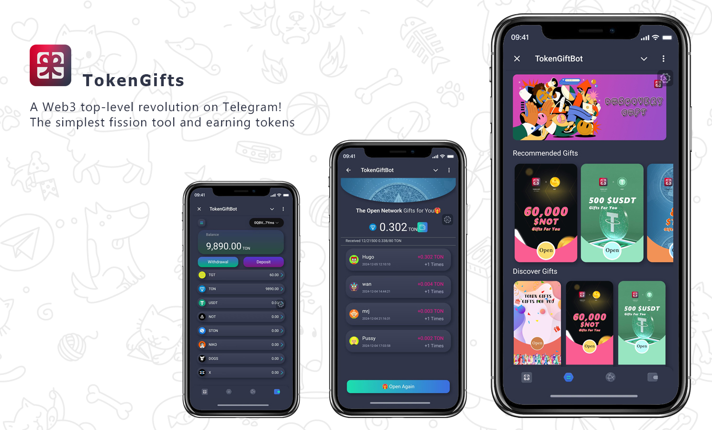

# 🎉 Overview

**Wellcome to TokenGifts. A Web3 top-level revolution on Telegram!**

## **What are Token Gifts**?

TokenGifts is a digital asset sharing tool based on blockchain technology that allows users to easily send gifts and other types of gifts to their friends and externally via Telegram. With Ton and Telegram, users can instantly send and receive cryptocurrencies globally, further enhancing the fun and convenience of social interactions.

## **Key Features**

The main features of TokenGifts include:

**_Sending Gifts_**: Users can send gifts in Telegram groups or private chats through simple operations. The sender can customise the gift amount, quantity and conditions for receiving it, making it a fun way to share wealth and blessings with friends or family.

**_Claiming the Gift_**: After receiving the gift notification, the recipient can claim the Gift according to the conditions set by the sender. These conditions may include time-limited collection, question-answer collection, etc., which increases the interactivity and fun of collecting gifts.

**_Support Gifts_**: In addition to traditional cash gifts, TokenGifts also supports sending cryptocurrencies and other digital gifts. These gifts can be specific cryptocurrencies, NFTs, etc.

**_Transaction History_**: Users can easily view the history of gifts they have sent and received, including the amount, status and collection details of the gifts. This helps users to manage their finances and gift exchange history.

**_Security and Privacy_**: Utilizing blockchain technology, TokenGifts ensures the security and transparency of transactions while protecting users' privacy. Users do not need to worry about personal information leakage or fund security.

## **Usage Scenarios**

TokenGifts is great for a variety of social occasions, including but not limited to:

- Holiday celebrations and wishes
- Birthday parties or other anniversaries
- Group activity rewards
- Random surprises among friends
- Community events and contest prizes

With the gifts in TokenGifts, users can enhance social interactions in Telegram in a new way while enjoying a safe and fast digital asset exchange experience.
